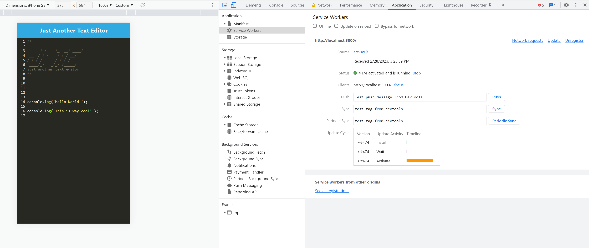
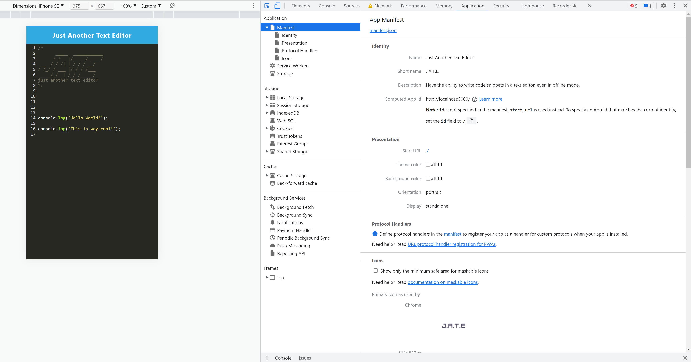

# Jot-It-Down

  

## Description

This is an installable application for a text editor. This application is also able to be installed on your local machine for offline use!

This taught me a good deal about the use of webpacks and service workers. Being able to install the application to my local machine was really neat to learn.

## Table of contents

- [Installation](#Insallation)
- [Deployment](#Deployment)
- [Usage](#Usage)
- [Contribution](#Contributing)
- [Mock-Up](#Mock-Up)
- [Questions](#Questions)

## Installation

For this program, we are using Express and Concurrently npm packages as dependencies. 
To use this application, clone this repository into a desired directory on your local machine. Then use your CLI to type `npm i` to install the dependencies found in the package.json file. 

Please refer to these links for documentation on these dependencies:
 - [Express](https://www.npmjs.com/package/express)
 - [Concurrently](https://www.npmjs.com/package/concurrently)

## Deployment

Heroku Link: 

## Usage

To install this to your local machine as a standalone application for offline use, there is an `Install!` button you can use. You may also launch a local server from your machine. To do this, type `npm run start` to launch the server. Simply open up your web browser to `http://localhost:3000` to view this application in the browser.

## Contributing

Source code provided from [Xandromus](https://github.com/coding-boot-camp/cautious-meme)

## Mock-Up

## Questions

Have questions? Please feel free to reach out to me at:

GitHub Username: [Christoph551](https://github.com/Christoph551)

Email: [Email](mailto:christopersimmonds551@gmail.com)